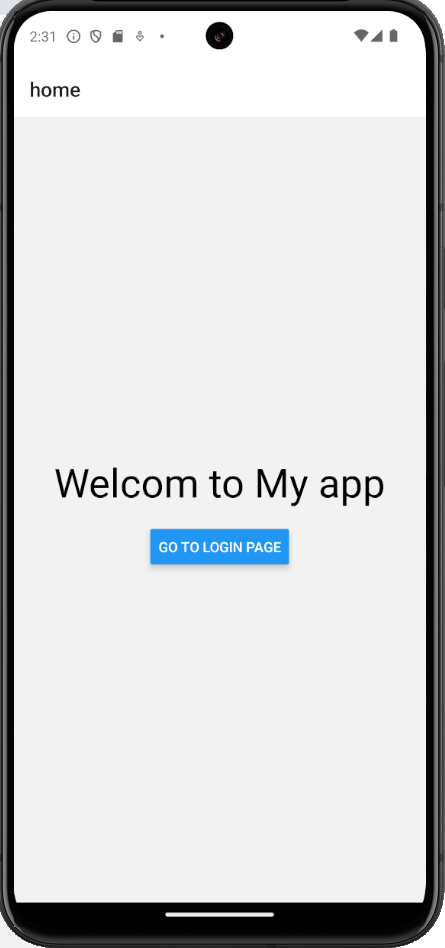
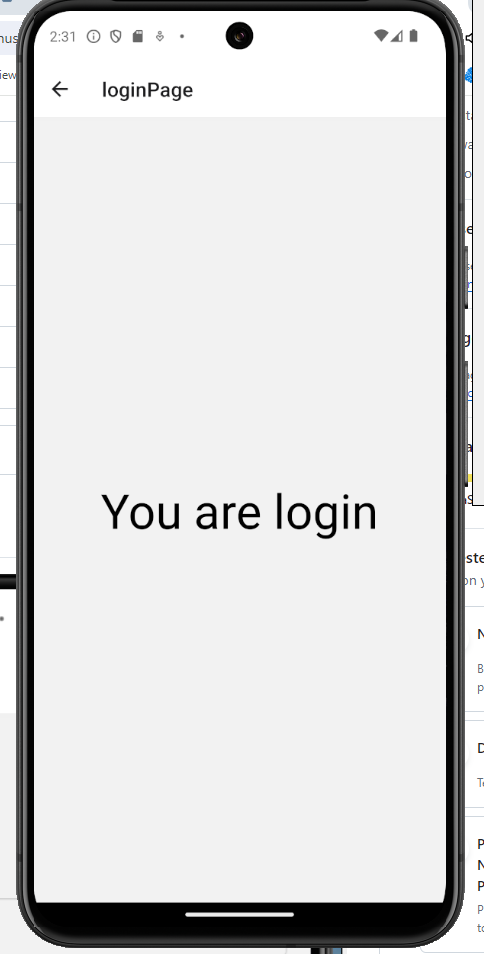

# LoginScreen

This project implements navigation, regex validation, and a password visibility toggle feature.

## Features

- Navigation using React Navigation
- Regex validation for email and password fields
- Password visibility toggle with eye button

## Installation

1. Clone the repository.
2. Navigate to the project directory.
3. Install dependencies using npm or yarn:

```bash
npm install
# or
yarn install


<br>

<br>


<br>

<br>


<br>

<br>



