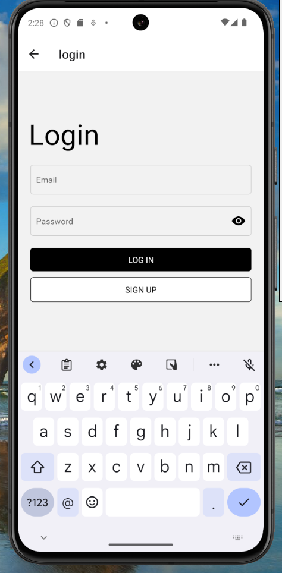

<h1>Login screen</h1>

<p>This project implements navigation, regex validation, and a password visibility toggle feature.
</p>

<h1>Features</h1>

<p>- Navigation using React Navigation <br>
- Regex validation for email and password fields<br>
- Password visibility toggle with eye button<br>
</p>


<h1>Installation</h1>

<p>
1. Clone the repository.
2. Navigate to the project directory.
3. Install dependencies using npm or yarn:
</p>


<p>
```bash
npm install
# or
yarn install

npm run andriod <br>
or
</p>


<h1>Download apk using link:</h1>

<p>https://expo.dev/artifacts/eas/oPEcHKeN4tKcmoshzRQp3a.apk</p>


<br>

<br>


<br>

<br>


<br>

<br>


<br>


<br>


